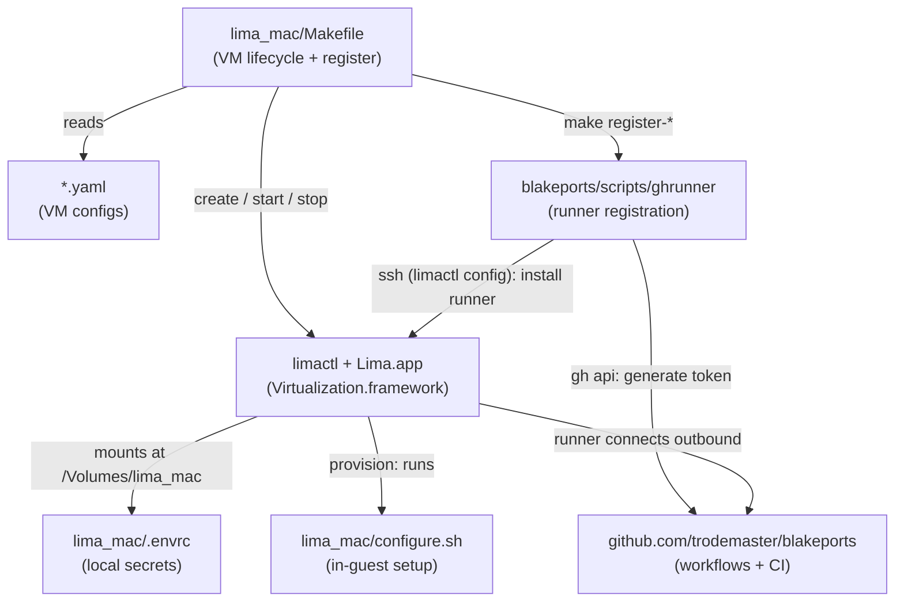

# lima_mac

This repository contains Lima configurations and tooling for running macOS guest VMs on Apple
Silicon. It replaces Tart as the mechanism for modern macOS CI runners and provides a
consistent environment for testing [blakeports](https://github.com/trodemaster/blakeports)
changes across multiple macOS versions.

The `Makefile` is the single entry point for all VM lifecycle operations — creating, starting,
stopping, and registering VMs as GitHub Actions runners. In-guest configuration (dotfiles,
password, sudo setup) is handled by `configure.sh`, which runs inside the VM at first boot via
Lima's provisioning system.

Runner registration is optional. VMs are useful standalone for manual testing. When needed for
CI, `make register-*` generates a fresh GitHub Actions token on the host and installs the runner
service inside the VM over SSH — no `gh auth` ever runs inside a guest VM.

---

## Architecture

```
lima_mac/
  Makefile          ← VM lifecycle + runner registration entry point
  configure.sh      ← in-guest setup (dotfiles, password, sudo)
  .envrc            ← local secrets (gitignored, see .envrc.template)
  macos-26.yaml     ┐
  macos-26-beta.yaml├─ Lima VM configurations
  macos-15.yaml     ┘

blakeports/
  scripts/ghrunner  ← runner registration, uses limactl SSH to install runner in VM
  .github/workflows ← CI jobs that run on the registered runners
```



---

## VM Targets

| Make target     | Lima instance   | Runner label    | IPSW                        | Purpose                       |
|-----------------|-----------------|-----------------|-----------------------------|-------------------------------|
| `macos-26`      | `macos-26`      | `macOS_26`      | macOS 26.4 (Tahoe)          | Current macOS release         |
| `macos-26-beta` | `macos-26-beta` | `macOS_26_beta` | macOS 26.5 Dev Beta 1       | Beta track testing            |
| `macos-15`      | `macos-15`      | `macOS_15`      | macOS 15.6.1 (Sequoia)      | N-1 major release             |

---

## Quick Start

### Prerequisites

- Apple Silicon Mac
- [Lima](https://lima-vm.io/) ≥ 2.1.0 (install via MacPorts: `sudo port install lima`)
- `Lima.app` bundle at `/Applications/MacPorts/Lima.app` (required for GUI on macOS 26+)
- `gh` CLI authenticated (`gh auth status`)

### Setup secrets

```bash
cp .envrc.template .envrc
# edit .envrc — set MACOS_PASSWORD at minimum
```

### Create and start a VM

```bash
make macos-26        # create the VM (installs macOS, runs configure.sh — takes ~10 min)
make run-26          # start the VM with GUI window
make status          # check all VM states
```

### Register as a GitHub Actions runner (optional)

The VM must be running before registering.

```bash
make register-26          # register macos-26 as the macOS_26 runner
make register-26-beta     # register macos-26-beta as the macOS_26_beta runner
make register-15          # register macos-15 as the macOS_15 runner
```

To de-register (removes GitHub registration, leaves VM running):

```bash
make unregister-26
```

---

## Makefile reference

| Target              | Description                                      |
|---------------------|--------------------------------------------------|
| `macos-26`          | Create macOS 26 VM                               |
| `run-26`            | Start macOS 26 VM                                |
| `clean-26`          | Stop and remove macOS 26 VM                      |
| `macos-26-beta`     | Create macOS 26 beta VM                          |
| `run-26-beta`       | Start macOS 26 beta VM                           |
| `clean-26-beta`     | Stop and remove macOS 26 beta VM                 |
| `macos-15`          | Create macOS 15 VM                               |
| `run-15`            | Start macOS 15 VM                                |
| `clean-15`          | Stop and remove macOS 15 VM                      |
| `status`            | Show status of all Lima instances                |
| `register-26`       | Register macOS 26 VM as GitHub Actions runner    |
| `register-26-beta`  | Register macOS 26 beta VM as runner              |
| `register-15`       | Register macOS 15 VM as runner                   |
| `unregister-26`     | De-register macOS 26 runner from GitHub          |
| `unregister-26-beta`| De-register macOS 26 beta runner from GitHub     |
| `unregister-15`     | De-register macOS 15 runner from GitHub          |
| `help`              | Show help                                        |

Override defaults:

```bash
make macos-26 LIMACTL=/opt/local/bin/limactl
make register-26 GHRUNNER=/path/to/ghrunner
```

---

## Environment variables (`.envrc`)

Copy `.envrc.template` to `.envrc` (gitignored). Variables sourced by `configure.sh` inside
the VM at provision time:

| Variable        | Purpose                                                      |
|-----------------|--------------------------------------------------------------|
| `MACOS_PASSWORD`| Sets the guest user password (replaces Lima-generated one)   |
| `SKIP_CHEZMOI`  | Set to `1` to skip dotfile provisioning                      |

---

## IPSW URL reference

IPSW files are downloaded from Apple's CDN (`updates.cdn-apple.com`) at VM creation time.
URLs are hardcoded in each YAML file. To find URLs for new releases, the community-maintained
index at [insidegui/VirtualBuddy data/ipsws_v2.json](https://github.com/insidegui/VirtualBuddy/blob/main/data/ipsws_v2.json)
is a convenient lookup — these are Apple's own public CDN links.

---

## Known limitations

- **macOS 26 GUI requires `Lima.app` bundle** — macOS 26 (Tahoe) enforces that processes
  creating a `VZVirtualMachineView` run inside a registered `.app` bundle. A plain `limactl`
  binary crashes with `SIGTRAP`. The fix is to install Lima via MacPorts (which places
  `Lima.app` at `/Applications/MacPorts/`) and let `limactl` re-launch the hostagent inside
  the bundle automatically. See upstream issue
  [lima-vm/lima#4743](https://github.com/lima-vm/lima/issues/4743).

- **Simultaneous VM limit** — Apple's `Virtualization.framework` may enforce a limit on how
  many macOS guest VMs can run concurrently on a single host. Behavior with all 3 instances
  running simultaneously has not yet been tested.

- **No automatic port forwarding** — macOS guests do not implement Lima's port forwarding
  protocol. Use the `vzNAT` IP directly or manual `ssh -L` tunnels.

- **`/run` is read-only on macOS guests** — Lima's SSH auth socket link step always fails,
  causing Lima to report `DEGRADED` status. The VM is fully functional; the status is cosmetic.
