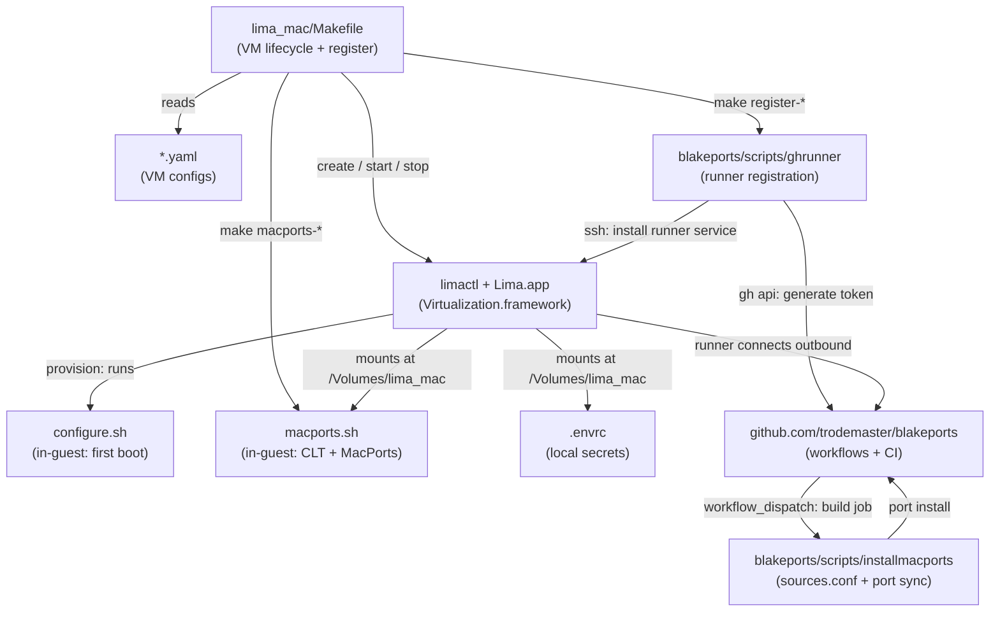

# lima_mac

Lima configurations and tooling for running macOS guest VMs on Apple Silicon. Replaces Tart
as the mechanism for modern macOS CI runners and provides a consistent environment for testing
[blakeports](https://github.com/trodemaster/blakeports) ports across multiple macOS versions.

The `Makefile` is the single entry point for all VM lifecycle operations. In-guest
configuration (password, sudo, auto-login, SSH keys) is handled by `configure.sh`, which runs
inside the VM at first boot via Lima's provisioning system. MacPorts installation is a separate
explicit step (`macports.sh`) run once after VM creation before runner registration.

Runner registration is optional — VMs are useful standalone for manual testing. When needed for
CI, `make register-*` generates a fresh GitHub Actions token on the host and installs the runner
service inside the VM over SSH.

---

## Architecture

```
lima_mac/
  Makefile           ← VM lifecycle + MacPorts install + runner registration
  configure.sh       ← in-guest setup at first boot (password, auto-login, SSH keys)
  macports.sh        ← install Xcode CLT + MacPorts in the VM (run once, explicit)
  .envrc             ← local secrets (gitignored, see .envrc.template)
  macos-26.yaml      ┐
  macos-26-beta.yaml ├─ Lima VM configurations
  macos-15.yaml      ┘

blakeports/
  scripts/ghrunner       ← runner registration (limactl SSH → install runner service)
  scripts/installmacports← configures sources.conf + port sync (runs at workflow time)
  .github/workflows/     ← build-*.yml CI jobs that run on the registered runners
```



---

## VM Targets

| Make target     | Lima instance   | Runner label    | macOS version          | Purpose               |
|-----------------|-----------------|-----------------|------------------------|-----------------------|
| `macos-26`      | `macos-26`      | `macOS_26`      | 26.4 Tahoe             | Current release       |
| `macos-26-beta` | `macos-26-beta` | `macOS_26_beta` | 26.5 Dev Beta 1        | Beta track testing    |
| `macos-15`      | `macos-15`      | `macOS_15`      | 15.6.1 Sequoia         | N-1 major release     |

---

## First-time runner setup

The full sequence to bring a VM from nothing to a working GitHub Actions runner:

```bash
# 1. Create the VM — provisions macOS, runs configure.sh (~10 min)
make macos-26

# 2. Start the VM
make run-26

# 3. Install Xcode CLT + MacPorts inside the VM (~10-30 min, runs once)
#    macOS 15: downloads binary PKG from macports.org
#    macOS 26: also downloads binary PKG (MacPorts-*.pkg now available for Tahoe)
make macports-26

# 4. Register as a GitHub Actions runner
make register-26
```

After the first `make macports-*`, subsequent workflow runs are faster because the ports tree
is already indexed (`portindex` only re-runs when sources change).

### All three runners

```bash
make macos-26 && make run-26 && make macports-26 && make register-26
make macos-26-beta && make run-26-beta && make macports-26-beta && make register-26-beta
make macos-15 && make run-15 && make macports-15 && make register-15
```

---

## Prerequisites

- Apple Silicon Mac running macOS 15+
- Lima 2.1+ (install via MacPorts: `sudo port install lima`)
- `Lima.app` at `/Applications/MacPorts/Lima.app` — required for GUI on macOS 26
  (Lima installed via MacPorts places this automatically)
- `gh` CLI authenticated (`gh auth status`)
- `jq` installed

---

## Secrets setup

```bash
cp .envrc.template .envrc
# edit .envrc — set at minimum MACOS_PASSWORD
direnv allow     # or: source .envrc
```

Variables are sourced by `configure.sh` inside the VM at provision time via the
`/Volumes/lima_mac/.envrc` mount.

---

## Makefile reference

### VM lifecycle

| Target              | Description                                                       |
|---------------------|-------------------------------------------------------------------|
| `macos-26`          | Create macOS 26 VM (first-time: create + provision + stop)        |
| `run-26`            | Start macOS 26 VM                                                 |
| `macports-26`       | Install Xcode CLT + MacPorts in macOS 26 VM (**run once**)        |
| `clean-26`          | Force-stop and remove macOS 26 VM                                 |
| `macos-26-beta`     | Create macOS 26 Beta VM                                           |
| `run-26-beta`       | Start macOS 26 Beta VM                                            |
| `macports-26-beta`  | Install Xcode CLT + MacPorts in macOS 26 Beta VM (**run once**)   |
| `clean-26-beta`     | Force-stop and remove macOS 26 Beta VM                            |
| `macos-15`          | Create macOS 15 VM                                                |
| `run-15`            | Start macOS 15 VM                                                 |
| `macports-15`       | Install Xcode CLT + MacPorts in macOS 15 VM (**run once**)        |
| `clean-15`          | Force-stop and remove macOS 15 VM                                 |
| `status`            | Show status of all Lima instances                                 |

### Runner registration (VM must be running)

| Target              | Description                                       |
|---------------------|---------------------------------------------------|
| `register-26`       | Register macOS 26 as GitHub Actions runner        |
| `unregister-26`     | De-register macOS 26 runner (VM preserved)        |
| `register-26-beta`  | Register macOS 26 Beta as GitHub Actions runner   |
| `unregister-26-beta`| De-register macOS 26 Beta runner                  |
| `register-15`       | Register macOS 15 as GitHub Actions runner        |
| `unregister-15`     | De-register macOS 15 runner                       |

Override defaults:

```bash
make macos-26 LIMACTL=/opt/local/bin/limactl
make register-26 GHRUNNER=/path/to/ghrunner
```

---

## Environment variables (`.envrc`)

Copy `.envrc.template` to `.envrc` (gitignored). Variables are read by `configure.sh`
inside the VM at first boot via the shared volume mount.

| Variable        | Default | Purpose                                                       |
|-----------------|---------|---------------------------------------------------------------|
| `MACOS_PASSWORD`| —       | Sets the guest user password (replaces Lima-generated one)    |
| `SKIP_CHEZMOI`  | `0`     | Set to `1` to skip dotfile provisioning (speeds up rebuilds)  |
| `SSH_PUBLIC_KEY` | —      | Injects a specific SSH public key into `authorized_keys`       |
| `AUTO_LOGIN`    | `1`     | Set to `0` to show the login screen instead of auto-login     |

MacPorts installation (`make macports-*`) is independent of these variables — it is not
controlled by `configure.sh` and is always explicit.

---

## macports.sh

`macports.sh` is shared into the VM at `/Volumes/lima_mac/macports.sh` via the virtiofs
mount. The `make macports-*` targets run it with `limactl shell`. It is idempotent — safe to
re-run.

What it does:
1. **Xcode CLT** — headless install via `softwareupdate` (the `xcode-select --install`
   flag opens a GUI dialog and cannot be used over SSH)
2. **MacPorts** — downloads the binary `.pkg` from the GitHub releases API matching the
   current macOS major version (`MacPorts-X.Y.Z-<MAJOR>-<Codename>.pkg`). Falls back to
   building from source tarball if no PKG is found for the running macOS version
3. **macports.conf** — appends `applications_dir`, `host_blacklist`, and `preferred_hosts`
   (fcix mirror)
4. **archive_sites.conf** — configures fcix and MIT binary archive mirrors
5. **`port selfupdate`** — syncs the ports tree

> **Note:** `sources.conf` is intentionally left alone by `macports.sh`. It is configured at
> workflow run time by `blakeports/scripts/installmacports`, which points it to the GitHub
> Actions runner workspace checkout of blakeports.

---

## How workflow builds work

When a `build-*.yml` workflow runs on a Lima runner:

1. GitHub dispatches the job to the runner service (`/opt/actions-runner`)
2. `actions/checkout` checks out `blakeports` into
   `/opt/actions-runner/_work/blakeports/blakeports`
3. `./scripts/installmacports` runs — configures `sources.conf` to point to that checkout,
   runs `port -v sync` (fast after first run, skipped if already configured)
4. `port lint`, `sudo port install`, etc. run against the local blakeports overlay

The first workflow run after `make macports-*` takes longer because `portindex` must index
the full ports tree (~77,000 ports). Subsequent runs are fast.

---

## IPSW URL reference

IPSW files are downloaded from Apple's CDN at VM creation time. URLs are hardcoded in each
YAML file. To find URLs for new releases, the community-maintained index at
[insidegui/VirtualBuddy data/ipsws_v2.json](https://github.com/insidegui/VirtualBuddy/blob/main/data/ipsws_v2.json)
is a convenient lookup — these are Apple's own public CDN links.

---

## Known limitations

**macOS 26 requires `Lima.app` bundle** — macOS 26 (Tahoe) enforces that processes creating
a `VZVirtualMachineView` run inside a registered `.app` bundle. A plain `limactl` binary
crashes with `SIGTRAP`. Install Lima via MacPorts; `Lima.app` is placed automatically at
`/Applications/MacPorts/`. See upstream issue
[lima-vm/lima#4743](https://github.com/lima-vm/lima/issues/4743).

**`port sync` is slow on first workflow run** — After fresh MacPorts installation,
`portindex` must build the full port index (~77k ports). This takes 10-20 minutes on the
first CI run. It is a one-time cost per VM; subsequent runs skip the sync.

**Simultaneous VM limit** — Apple Virtualization.framework may limit concurrent macOS guest
VMs on a single host. All three instances running simultaneously has not been tested.

**No automatic port forwarding** — macOS guests do not implement Lima's port forwarding
protocol. Use the `vzNAT` IP directly or manual `ssh -L` tunnels.

**`/run` is read-only on macOS guests** — Lima's SSH auth socket link step always fails,
causing `limactl list` to show `DEGRADED`. The VM is fully functional; this is cosmetic.
