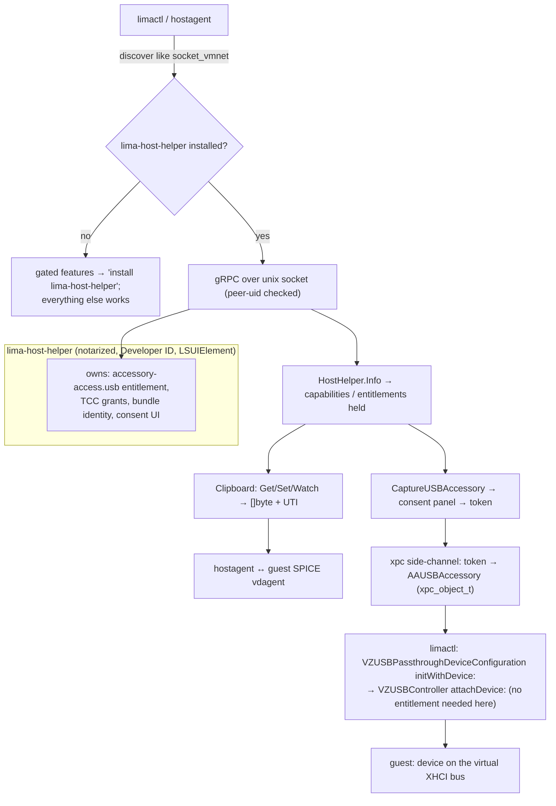

# A host-capability helper interface for Lima

Design notes for a potential upstream proposal: a **small, optional, separately
distributed helper process** that holds the macOS app-bundle identity, TCC
grants, and provisioning-profile entitlements that `limactl` / the host agent
structurally cannot, and exposes them back to Lima over a narrow local IPC.

Motivation: several host-side features keep hitting the same wall. The VZ SPICE
clipboard (blakeports B4) was parked because Apple's clipboard pump appears to
need real app-bundle identity. Native `vz` USB passthrough
([vz-usb-passthrough.md](vz-usb-passthrough.md)) needs `AAUSBAccessoryManager`,
which the header says is "only for … an application that appears in the Dock"
and requires the `com.apple.developer.accessory-access.usb` entitlement. The
Lima maintainers do not want to ship `limactl` as a GUI `.app`. A capability
helper is a way to get these features without changing what `limactl` is.

Status: proposal sketch, not started. No upstream issue yet.

---

## Why a CLI binary can't do these things

macOS gates capabilities on properties a bare, MacPorts/Homebrew-built,
ad-hoc-signed CLI executable does not have:

| Capability | Gate | Can `limactl` get it? |
|-----------|------|----------------------|
| USB accessory capture (`AAUSBAccessoryManager`) | Dock-visible app + `com.apple.developer.accessory-access.usb` (provisioning profile) + consent panel | No |
| VZ SPICE clipboard pump | app-bundle identity (working hypothesis from B4; unconfirmed) | Unclear, leaning no |
| Screen Recording / screenshot of the guest window | TCC `kTCCServiceScreenCapture`, prompt tied to a stable bundle id | Prompt has no bundle to attach to |
| Apple Events / "reveal in Finder" / automation | TCC `kTCCServiceAppleEvents`, per-(bundle id, target) | Same |
| Camera / microphone into the guest | TCC + `NSCameraUsageDescription` in an `Info.plist` | No `Info.plist` |
| User notifications (`UNUserNotificationCenter`) | Requires a bundle id | No |
| Location | TCC + usage-description keys | No |
| Hypervisor (`com.apple.security.hypervisor`) | ad-hoc `codesign --entitlements` is enough | **Yes** — Lima already self-signs qemu (`pkg/driver/qemu/entitlementutil`) |

The last row is the key boundary: **ad-hoc signing can grant
`com.apple.security.*` entitlements** (Lima does this for qemu today), **but not
`com.apple.developer.*` entitlements**, which require an Apple Developer Team and
a provisioning profile baked into a signed bundle. Everything a helper would
unlock is on the far side of that line, plus the TCC prompts that need a
durable bundle identity to bind a grant to.

---

## Lima already has every building block

This is not a new architectural direction for Lima — it's the same three
patterns Lima already ships, pointed at a new target.

1. **External driver plugins.** `lima-driver-vz` / `-qemu` / `-krunkit` /
   `-wsl2` are separate binaries. The host agent is a gRPC **client**; each
   driver binary is the **server**; transport is gRPC over a unix domain
   socket (`pkg/driver/external/client` dials `unix://<socketPath>`).
   `driver.proto` is "the authoritative contract for driver authors", with
   JSON payloads for structured data "to stay in sync with the Go types
   without duplicating them here". GUI-ish calls (`RunGUI`,
   `ChangeDisplayPassword`, `GetDisplayConnection`) already cross that
   boundary. A capability helper is the same idea with its own small proto.

2. **`socket_vmnet`.** An *optional, separately installed, more-privileged*
   helper. Lima discovers it by scanning candidate paths (`/opt/socket_vmnet`,
   both Homebrew prefixes, `$PATH`), talks to it over a unix socket, and
   **degrades to user-mode networking when it is absent**. That is exactly the
   distribution + discovery + graceful-degradation model a capability helper
   wants, and the maintainers already accept it.

3. **Runtime entitlement signing.** `entitlementutil` runs
   `codesign --sign - --entitlements … --force` on the qemu binary to add the
   hypervisor entitlement. Precedent that Lima will do signing work for the
   user — and a concrete demonstration of where ad-hoc signing stops.

---

## Proposed shape

### Distribution & lifecycle

- A separate project/artifact — `lima-host-helper` (name TBD) — built and
  **notarized by the Lima project** with a real Developer ID, shipped as a
  Homebrew cask / MacPorts port / notarized `.zip`. Not in the `limactl`
  build. Not required for any Linux-guest workflow that doesn't use a gated
  capability.
- Runs as an `LSUIElement` agent (menu-bar item, no Dock icon) or, only if
  `AAUSBAccessoryManager` truly demands Dock presence, a minimal Dock app that
  is still *not* a VM manager — no instance list, no console, no create flow.
  Its entire job is brokering capabilities.
- Registered as a per-user login item via `SMAppService.agent` (macOS 13+), or
  launched on demand by `limactl` and left resident. It owns the TCC grants
  and the provisioning-profile entitlements; the human approves prompts once,
  against the helper's stable bundle id.
- `limactl` / hostagent **discovers it like `socket_vmnet`** (candidate paths
  + a `paths.hostHelper` config key) and connects to its socket. Absent →
  every gated feature reports a single actionable "install lima-host-helper"
  error and everything else works unchanged.

### IPC

gRPC over a unix socket, mirroring `pkg/driver/external`. A new
`hosthelper.proto`. Peer authentication via `getpeereid` / `LOCAL_PEERCRED`
(same uid only) and `0700` socket perms; the helper is more-privileged than
its caller, so the trust direction matters.

```proto
service HostHelper {
  rpc Info(Empty) returns (InfoResponse);            // version, capability flags, entitlements held

  // Clipboard — plain bytes, trivial.
  rpc GetClipboard(GetClipboardRequest) returns (ClipboardData);
  rpc SetClipboard(ClipboardData) returns (Empty);
  rpc WatchClipboard(Empty) returns (stream ClipboardChange);

  // USB accessory capture — the interesting one.
  rpc ListUSBAccessories(USBMatch) returns (USBAccessoryList);
  rpc CaptureUSBAccessory(CaptureRequest) returns (CaptureResponse); // shows consent UI
  rpc ReleaseUSBAccessory(ReleaseRequest) returns (Empty);
  rpc WatchUSBAccessories(USBMatch) returns (stream USBAccessoryEvent);

  // Room to grow: ScreenshotGuestWindow, PostNotification, RevealInFinder,
  // RequestCameraAccess, …
}
```

### Passing a captured device across the boundary

gRPC can't carry a live `AAUSBAccessory`, an `IOUSBHostDevice`, or a Mach
send-right in a protobuf field. Three workable mechanisms, in preference
order:

1. **`xpc_object_t` side-channel.** `AAUSBAccessory` is explicitly
   `NSSecureCoding` + has `createXPCRepresentation` / `initWithXPCRepresentation:`.
   `CaptureUSBAccessory` returns an opaque token; `limactl` then connects to a
   companion `xpc_connection_create_mach_service` endpoint the helper
   advertises, presents the token, and receives the accessory as an
   `xpc_object_t`. It rebuilds the `AAUSBAccessory`, wraps it in
   `VZUSBPassthroughDeviceConfiguration initWithDevice:`, and calls
   `attachDevice:` — none of which needs the helper's entitlement, because by
   then it's pure Virtualization.framework. **Open question:** does the XPC
   representation stay valid across a code-signature boundary (notarized
   helper → ad-hoc `limactl`)? Needs a spike; this is the make-or-break
   unknown.
2. **SCM_RIGHTS fd passing.** If the helper can hand over the underlying USB
   device fd (via `AAUSBAccessory.open` → `IOUSBHostDevice`, then an fd), send
   it over the existing unix socket as ancillary data. Simpler, but only helps
   if Virtualization.framework will build a passthrough device from a raw fd
   rather than an `AAUSBAccessory` — it currently won't (`initWithDevice:` only
   takes `AAUSBAccessory`), so this is a fallback for a non-VZ consumer.
3. **Helper owns the whole VZ USB attach.** The helper, not `limactl`,
   performs `attachDevice:` against the running VM — which means passing it the
   VM's `VZUSBController`, i.e. the VM would have to live in the helper. That
   collapses back into "the helper is the hypervisor", which defeats the
   point. Rejected.

Clipboard has none of this difficulty — it's `[]byte` plus a MIME/UTI tag.

---

## Prior art — this pattern is everywhere

A small, more-privileged / better-entitled broker driven by an unprivileged
client over a local socket is a well-worn macOS and Unix design:

| Project | Split |
|---------|-------|
| **`socket_vmnet`** (Lima's own dep) | unprivileged `limactl` ↔ root helper over a unix socket for `vmnet` bridged networking; optional, graceful fallback |
| **gpg-agent + `pinentry-mac`** | CLI `gpg` ↔ `gpg-agent` ↔ a GUI `pinentry` helper that owns the passphrase dialog / Keychain UI |
| **1Password CLI (`op`) ↔ 1Password desktop app** | CLI delegates biometric unlock and secret access to the app over a local IPC; the app holds the Secure Enclave / Touch ID integration |
| **Secretive**, **yubikey-agent** | an `LSUIElement` agent owns the Secure Enclave / YubiKey and exposes a plain `ssh-agent` socket; `ssh` is unmodified |
| **Docker Desktop `com.docker.vmnetd`** | privileged networking helper installed once; the unprivileged app/CLI drives it |
| **`vfkit`** (Podman, CRC) | a signed, entitled standalone Virtualization.framework binary driven over a REST socket by `podman machine` — the same "let a small signed binary hold the capability" move |
| **Tailscale** | open-source `tailscale` CLI ↔ `tailscaled` daemon; the App Store build pushes the privileged part into a Network Extension |
| **Karabiner-Elements** | core logic split into root daemons + a per-login-session `karabiner_console_user_server`, all over local sockets, so each piece has exactly the privilege/context it needs |
| **macOS itself** | `securityd`, `tccd`, `pboard`/`pasteboardd` — the OS brokers exactly these capabilities to apps over Mach IPC |

The recurring principle: **keep the large, frequently-changing program
unprivileged and unbundled; push the capability that needs signing / a bundle /
a consent prompt into a tiny component with a narrow, stable contract.** That
is precisely what Lima's maintainers already chose for networking with
`socket_vmnet`.

---

## Where changes land (conceptual, in Lima)

- New `pkg/hosthelper` (proto + gRPC client), sibling to `pkg/driver/external`.
- New `paths.hostHelper` config key + a candidate-path scan in `pkg/limayaml`
  / wherever `socket_vmnet` discovery lives (`pkg/networks/config.go` is the
  model).
- `pkg/hostagent` connects to the helper on start when the instance config
  requests a gated capability, subscribes to clipboard/USB streams, tears down
  on stop.
- Clipboard consumer: replaces / complements the parked B4 `VZSpiceAgentPort`
  path — the guest still needs a SPICE `vdagent`; the helper just supplies the
  host clipboard content the CLI can't pump itself.
- USB consumer: the `vz` half of [vz-usb-passthrough.md](vz-usb-passthrough.md)
  becomes "ask the helper to capture, then attach via Virtualization.framework".
- A new repo/dir for `lima-host-helper` itself (Swift or ObjC + a thin gRPC
  server), its signing/notarization CI, and packaging.
- `website/content/en/docs/` — a page explaining the optional helper, exactly
  like the current `socket_vmnet` docs.

## Functional flow



---

## Open questions

- **The XPC-across-signatures spike.** Does an `AAUSBAccessory` /
  `xpc_object_t` handed from a Developer-ID-signed helper survive
  reconstruction in an ad-hoc-signed `limactl`? If not, the helper must own
  the VZ attach too, and the clean split collapses. Prove this first.
- Will the Lima maintainers accept a second optional external component at
  all, or is `socket_vmnet` treated as a one-off they'd rather not repeat?
  (Worth an RFC issue before any code.)
- Can `AAUSBAccessoryManager` be used from an `LSUIElement` menu-bar agent, or
  does "appears in the Dock" mean a real Dock tile? Determines how minimal the
  helper can be.
- Is `com.apple.developer.accessory-access.usb` grantable to an open-source
  project's notarized artifact, or is it invite-only like some VM
  device-capture entitlements?
- Clipboard-only helper first? It has no entitlement blocker of its own (just
  the bundle-identity hypothesis), a guest-side component that already exists
  in the B4 work, and would validate the whole discovery/lifecycle/IPC design
  cheaply before the USB XPC work.
- Versioning: the helper and `limactl` ship separately (like `socket_vmnet`),
  so `HostHelper.Info` must carry a protocol version and Lima must tolerate an
  older or newer helper the way it tolerates `socket_vmnet` version skew.

## Recommendation

Open an upstream RFC issue describing the helper as the general answer to
"capabilities `limactl` can't hold", citing `socket_vmnet` as the accepted
precedent. If there's appetite, build **clipboard first** as the reference
implementation (lowest risk, existing guest side, unblocks B4), then layer USB
capture on the proven transport. Do the XPC-across-signatures spike before
committing to the USB design.
