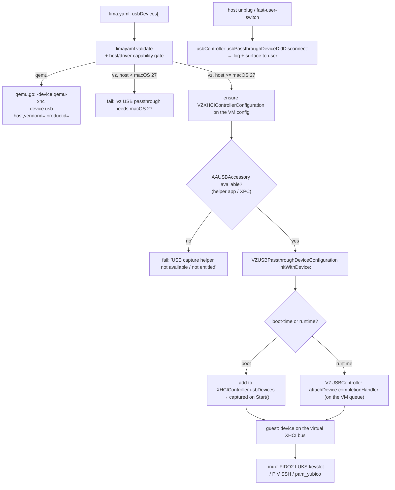

# USB device passthrough for the `vz` driver

Research + scoping notes for a potential upstream Lima feature: attach a host
USB device (concretely, a **YubiKey 5C** or a hardware TPM / FIDO2 token) to a
Linux guest running on Apple's Virtualization.framework (`vmType: vz`), without
falling back to QEMU.

Origin: a design conversation that started at "can the Apple PCC Virtual
Research Environment be used as a general secure VM" (no — it's a headless,
stripped PCC-node simulator that degrades host security posture), narrowed to
"I want a hardware root-of-trust inside a Linux `vz` guest and I don't want
QEMU", and landed on native `vz` USB passthrough as the feature that would
close that gap. The immediate use cases on the Linux side are LUKS2 keyslots
via `systemd-cryptenroll --fido2-device`, PIV/OpenPGP SSH keys held on the
token, and `pam_yubico` challenge-response for `sudo`.

Status as of 2026-09-09: **research only.** The passthrough class needs a
macOS 27 host, and — more importantly — the capture API (`AccessoryAccess`)
structurally conflicts with Lima's CLI-only architecture in the same way the
parked B4 clipboard work did. See "The architectural blocker" below before
investing in this.

Companion docs: [macos27-guest-provisioning.md](macos27-guest-provisioning.md)
(same macOS 27 / Xcode 27 SDK, same CGo-into-Virtualization pattern),
`blakeports/sysutils/lima-devl/TODO.md` § B4 (the clipboard feature parked for
the identical app-bundle reason).

---

## What already works vs. what is new

Verified on this host against `MacOSX27.0.sdk` (Xcode 27.0) headers on
2026-09-09.

| Piece | Symbol | Since | In Lima's Go binding (`Code-Hex/vz` v3.7.1)? |
|-------|--------|-------|---------------------------------------------|
| USB XHCI controller on a VM config | `VZXHCIControllerConfiguration` / `VZVirtualMachineConfiguration.usbControllers` | macOS 15.0 | **Yes** — `NewXHCIControllerConfiguration()`, `SetUSBControllersVirtualMachineConfiguration()` |
| Runtime hot-plug of a framework device | `-[VZUSBController attachDevice:completionHandler:]` / `detachDevice:` | macOS 15.0 | **Yes** — `USBController.Attach()` / `.Detach()` / `.USBDevices()` |
| USB mass-storage (disk image) device | `VZUSBMassStorageDevice(Configuration)` | macOS 15.0 | **Yes** — `NewUSBMassStorageDevice()` |
| **Host USB device passthrough** | `VZUSBPassthroughDevice` / `VZUSBPassthroughDeviceConfiguration` | **macOS 27.0** | **No** |
| **Host USB capture** | `AAUSBAccessoryManager` + `AAUSBAccessory` (`AccessoryAccess.framework`) | **macOS 27.0** | **No** |
| Controller disconnect callback | `VZUSBControllerDelegate.usbController:usbPassthroughDeviceDidDisconnect:` | macOS 27.0 | No |

So the controller plumbing and the hot-plug entry point have shipped since
Sequoia and Lima's binding already exposes them. The two genuinely new pieces
(macOS 27) are the passthrough *device* class and the `AccessoryAccess`
capture framework that produces the object it wraps. Apple presented both at
WWDC 2026 ("Expand the capabilities of your Virtualization app"), the same
session that introduced `VZMacGuestProvisioningOptions`.

---

## API surface (from the Xcode 27.0 SDK headers)

### Virtualization side

`VZUSBPassthroughDeviceConfiguration` — `API_AVAILABLE(macos(27.0))`,
`<NSCopying, VZUSBDeviceConfiguration>`. `init` / `new` are `NS_UNAVAILABLE`;
the only initializer is:

```objc
- (instancetype)initWithDevice:(AAUSBAccessory *)device NS_DESIGNATED_INITIALIZER;
```

`VZUSBPassthroughDevice` — `API_AVAILABLE(macos(27.0))`, conforms to
`VZUSBDevice`. `- (nullable instancetype)initWithConfiguration:(VZUSBPassthroughDeviceConfiguration *)configuration error:(NSError **)error`.

Two ways to get the device into the guest:

1. **Boot-time**: put the `VZUSBPassthroughDeviceConfiguration` in the
   `usbDevices` array of the `VZXHCIControllerConfiguration`. The device is
   captured when the VM starts.
2. **Runtime**: build a `VZUSBPassthroughDevice` directly and call
   `-[VZUSBController attachDevice:completionHandler:]` on the running VM's
   controller (this method must run on the VM's dispatch queue).

`VZUSBController.delegate` (macOS 27.0) — implement
`usbController:usbPassthroughDeviceDidDisconnect:` to learn when the host
device's `IOService` terminated (unplugged); the framework has already
removed it from `usbDevices` by the time the callback fires.

Errors (`VZError.h`, `VZErrorDomain`, all `macos(15.0)`):

| Code | Symbol | When |
|------|--------|------|
| `30001` | `VZErrorUSBControllerNotFound` | no XHCI controller on the VM |
| `30002` | `VZErrorDeviceAlreadyAttached` | device already on this or another controller |
| `30003` | `VZErrorDeviceInitializationFailure` | device could not be initialized |
| `30004` | `VZErrorDeviceNotFound` | detach called for a device that isn't attached |

### AccessoryAccess side (`AccessoryAccess.framework`, all `macos(27.0)`)

`AAUSBAccessoryManager` — singleton via `+ sharedManager`. Header, verbatim:

> As `AAUSBAccessoryManager` presents UI on behalf of your application, only
> use it from an ordinary application, that is, one that appears in the Dock.
> Sign your application with the `com.apple.developer.accessory-access.usb`
> entitlement.

```objc
- (void)registerListener:(id <AAUSBAccessoryListener>)listener
     withMatchingCriteria:(NSArray<AAUSBAccessoryMatchingCriteria *> *)matchingCriteria
        completionHandler:(void (^)(NSArray<AAUSBAccessory *> *alreadyConnected,
                                    NSError * _Nullable))completionHandler;
- (void)unregisterListener:(id <AAUSBAccessoryListener>)listener
          completionHandler:(void (^)(void))completionHandler;
```

`AAUSBAccessoryListener` — `usbAccessoryDidConnect:` / `usbAccessoryDidDisconnect:`
(invoked on the manager's serial queue). Already-connected matching devices
come back in the `registerListener` completion handler, not through
`didConnect:`.

`AAUSBAccessoryMatchingCriteria` — built from **IOKit matching dictionaries**,
not bare VID/PID integers:

```objc
- (instancetype)initWithDeviceMatchingDictionary:(NSDictionary *)dictionary;
- (instancetype)initWithDeviceMatchingDictionary:(NSDictionary *)deviceDict
                     interfaceMatchingDictionaries:(NSArray<NSDictionary *> *)ifaceDicts
                           interfaceMatchingOption:(AAUSBAccessoryMatchingCriteriaInterfaceMatchingOption)opt;
```

Build the dictionary with `-[IOUSBHostDevice createMatchingDictionaryWithVendorID:productID:…]`.
An empty criteria array matches any USB device.

`AAUSBAccessory` — `registryID` (`uint64_t`), `deviceDescriptorData`
(cast to `IOUSBDeviceDescriptor`), `configurationDescriptorData`,
`open(serviceQueue:completionHandler:)` → `IOUSBHostDevice`,
`close(completionHandler:)`. **Encodable to `xpc_object_t`**
(`createXPCRepresentation` / `initWithXPCRepresentation:`) — this is the
seam that makes a helper-process architecture possible (see below).

`AAErrorDomain` codes: `1` internal, `2` listener already registered,
`3` accessory not accessible (in use), `4` invalid accessory state.

### Behavioral constraints (verbatim from the headers)

> When a fast user switch occurs or when the console user logs out (even with
> active remote sessions), all connected USB accessories will be automatically
> disconnected from client applications … accessories will be automatically
> restored and reconnection notifications will be sent through
> `usbAccessoryDidConnect:`.

> The USB device is captured when the `VZVirtualMachine` is started with a
> `VZUSBPassthroughDeviceConfiguration` … The USB device is also captured by a
> running `VZVirtualMachine` when `-[VZUSBController attachDevice:completionHandler:]`
> is called.

Capture is **exclusive** — while the guest holds the device it is gone from
macOS. For a YubiKey that means Touch ID's fallback, `sc_auth`, browser
WebAuthn, and any host GPG/PIV use of that key stop working until detach.

---

## The architectural blocker

`AAUSBAccessoryManager` is explicitly scoped to "an ordinary application …
that appears in the Dock", it "presents UI on behalf of your application"
(a consent panel), and it requires the `com.apple.developer.accessory-access.usb`
entitlement, which is a provisioning-profile entitlement tied to an Apple
Developer Team.

Lima's `limactl` / hostagent is a bare CLI binary with no bundle, no
`Info.plist`, no Dock presence, and — as built by MacPorts for `lima-devl` —
ad-hoc-signed with no team entitlements. This is the **same wall B4 (VZ SPICE
clipboard) hit**: Apple's newer Virtualization-adjacent APIs assume a real
`.app`, and "Lima's maintainers are strongly against shipping limactl/hostagent
as an app bundle" (blakeports `TODO.md` § B4).

There is one way around it that does *not* require bundling `limactl`:

**A separate, signed helper** does the `AccessoryAccess` capture (it owns the
entitlement and shows the consent UI), then hands the captured `AAUSBAccessory`
to `limactl`/hostagent as an `xpc_object_t` over an XPC connection
(`createXPCRepresentation` on one side, `initWithXPCRepresentation:` on the
other). `limactl` then only touches Virtualization.framework
(`VZUSBPassthroughDeviceConfiguration initWithDevice:`, `attachDevice:`), which
needs no special entitlement. This is a real design but a large one — a new
shippable macOS artifact, its signing/notarization, its lifecycle, and an IPC
protocol.

That helper need not be USB-specific. The same wall blocks the VZ SPICE
clipboard (B4) and a handful of other host features, and Lima already ships an
optional privileged helper (`socket_vmnet`) and an external-plugin gRPC
transport. Generalising it into one **host-capability helper** is scoped
separately in [host-capability-helper.md](host-capability-helper.md); USB
capture is one consumer of that interface.

**Recommendation:** if hardware-token-in-a-Linux-VM is the actual goal,
the QEMU-driver path (Lima issue #4766, draft PR #4825) has none of this
blocker and is the pragmatic near-term answer, at the cost of QEMU's speed
and battery penalty. Treat native `vz` passthrough as blocked-by-design like
B4 until either Apple relaxes the app-bundle requirement or the helper-app
architecture is explicitly wanted.

---

## Prior art in Lima

All QEMU-only; nothing targets `vz`:

- **#4766** "QEMU: implement USB passthrough" — open (2026-08-04),
  `component/qemu`.
- **#2224** "USB passthrough rabbit hole" — QMP `device_add usb-host` gets
  `libusb … [ACCESS]` and can hang the instance on bad syntax.
- **PR #4825** — draft, adds a `usb:` YAML key for the QEMU driver.
- **PR #1317** — 2023 POC, whole-bus USB sharing.

Lima has **no `usb:` configuration today** for any driver. `pkg/driver/qemu`
only ever emits a fixed `-device qemu-xhci,id=usb-bus` for the input devices.

---

## Proposed feature shape (if pursued)

### `lima.yaml`

A top-level device list, shaped like `additionalDisks` / `mounts` — it
describes guest hardware, not backend tuning, so it should not be nested
under `vmOpts.<driver>`:

```yaml
usbDevices:
  - vendorId: 0x1050        # Yubico
    productId: 0x0407       # YubiKey 5C — OTP+FIDO+CCID composite
  # - name: "hardware TPM"  # optional label for messages
```

Support is per-driver and gated: on `vz` it needs host macOS ≥ 27 **and** a
capture path (helper app or a future entitlement); on `qemu` it maps to
`-device qemu-xhci` + `-device usb-host,vendorid=,productid=`. When the running
driver/host can't honour an entry, fail closed at validation with a message
that names the missing capability — never start the VM having silently dropped
a security device the user asked for.

### Where changes land (conceptual)

- `pkg/limatype/lima_yaml.go` — new `USBDevice` struct + `USBDevices []USBDevice`;
  `limayaml.FillDefault` / validation, including the host-version and
  driver-capability gate.
- `pkg/driver/vz/` — a CGo/ObjC module (mirroring the
  `feat/vz-mac-guest-provisioning` layout: `usb_passthrough_darwin_arm64.{go,h,m}`,
  all runtime ObjC dispatch so it builds against any SDK): ensure an
  `VZXHCIControllerConfiguration` exists on the config, obtain each
  `AAUSBAccessory` (from the helper over XPC, or degrade with a clear error),
  wrap it in `VZUSBPassthroughDeviceConfiguration`, and either seed
  `usbDevices` at build time or `attachDevice:` after `Start()`. Implement
  `VZUSBControllerDelegate` to log/report unplug.
- `pkg/driver/qemu/qemu.go` — append the `usb-host` device args; reuse the
  existing `qemu-xhci` bus.
- A shared `hostMacOSMajorVersion()` helper — still absent from the tree, also
  wanted by the two macOS 27 PRs already queued.
- `website/content/en/docs/config/` — document `usbDevices`, the `vz` host
  requirement, the exclusive-capture caveat, and the fast-user-switch
  auto-detach behavior.

### Functional flow



---

## Design challenges

- **CGo ↔ ObjC lifetime.** `attachDevice:completionHandler:` and the
  AccessoryAccess callbacks are async blocks on framework queues. Runtime
  device handles must be pinned (cgo.Handle) until the completion handler
  runs, or Go's GC will reclaim them mid-attach — the exact class of bug the
  guest-provisioning branch already manages by hand.
- **Matching is IOKit dictionaries, not ints.** The YAML `vendorId`/`productId`
  have to be turned into an `IOUSBHostDevice` matching dictionary before an
  `AAUSBAccessoryMatchingCriteria` can be built.
- **Composite devices.** A YubiKey enumerates as smartcard (CCID) + HID +
  FIDO simultaneously; capture takes the whole device. Document that the key
  vanishes from the host the instant the guest attaches it, and returns on
  detach / VM stop.
- **Signing fallback.** If the process lacks the capture entitlement, detect
  it and emit a single actionable error (which helper to install / how it's
  signed) rather than a raw `AAErrorCodeAccessoryNotAccessible`.
- **Save/restore.** `VZUSBDeviceConfiguration.uuid` must be round-tripped
  across VM save/restore; a passthrough device almost certainly can't be
  restored and should be dropped with a warning on resume.

---

## Open questions

- Is `com.apple.developer.accessory-access.usb` obtainable for an
  open-source project's notarized helper, or is it gated like the VM
  device-capture entitlements? (Needs an Apple Developer account check.)
- Does `AAUSBAccessory`'s XPC representation survive crossing from a helper
  app to a MacPorts-built, ad-hoc-signed `limactl`, or does the framework
  bind it to the originating code signature?
- Can the boot-time path (`usbDevices` in the config) capture a device that
  the helper opened, or does boot-time capture require the *VM process
  itself* to hold the entitlement — making only the runtime `attachDevice:`
  path viable via a helper?
- Scope check with upstream: would maintainers take a `usbDevices:` key that
  is QEMU-only on day one, with `vz` support landing later behind the helper?
  (#4766 suggests appetite exists for the QEMU half.)
